# task_management

| Splash Screen | Splash Dark                       |
|------|-------------------------------------------|
||  |
| Tasks Screen Light | Tasks Screen Dark                       |
| 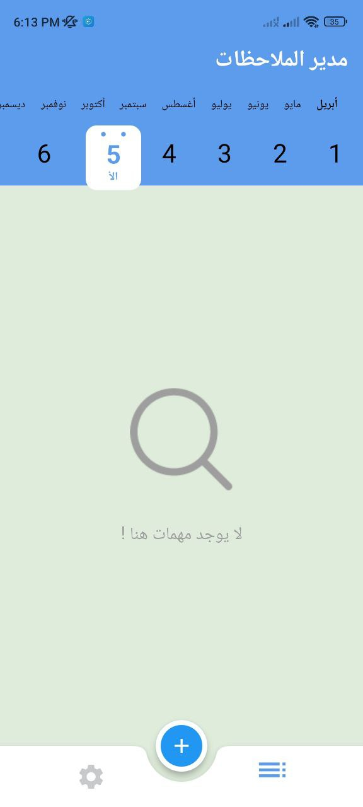 | 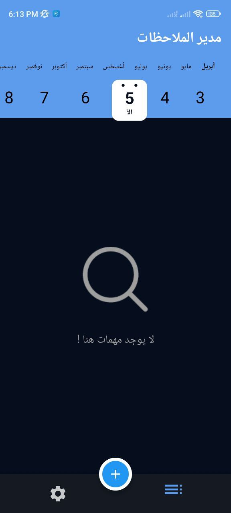 |
| Add Task Screen Light |  Add Task Screen Dark                       |
|  | 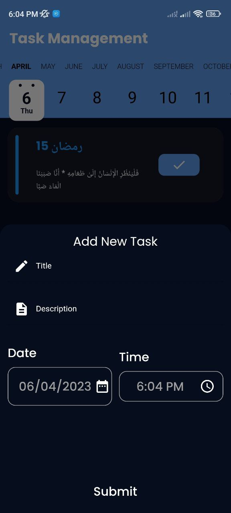 |
| Add Task Screen Light | Add Task Screen Dark                       |
| 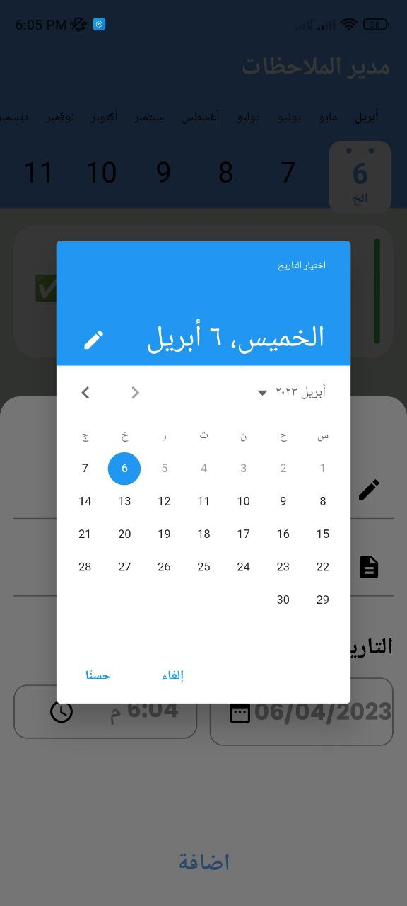 | 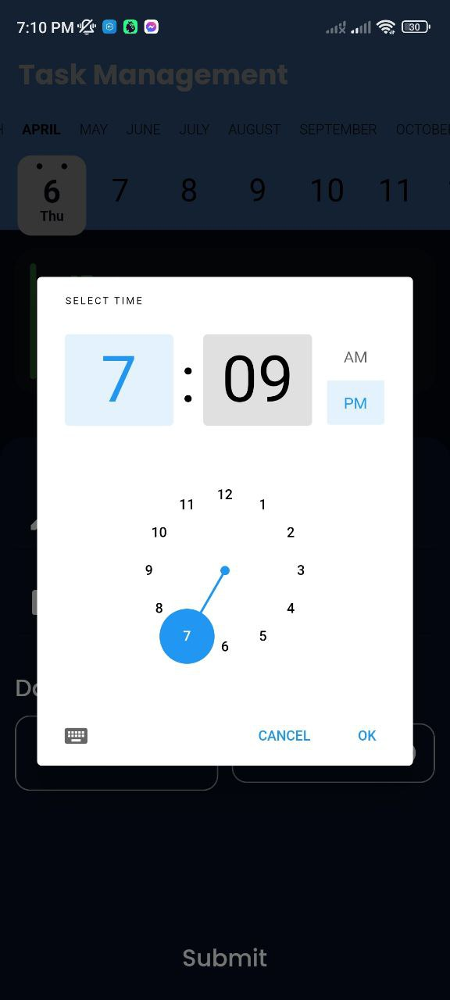 |
| Tasks Screen Light | Tasks Screen Dark                       |
| 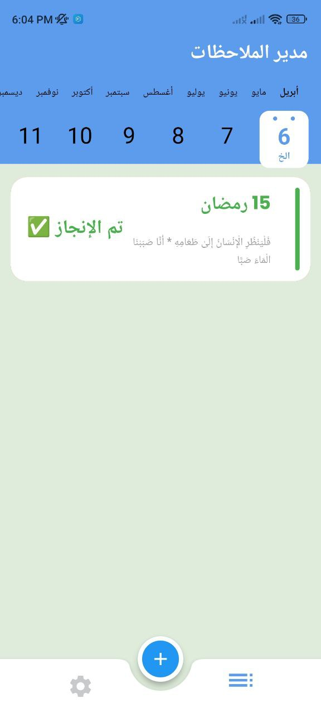 | 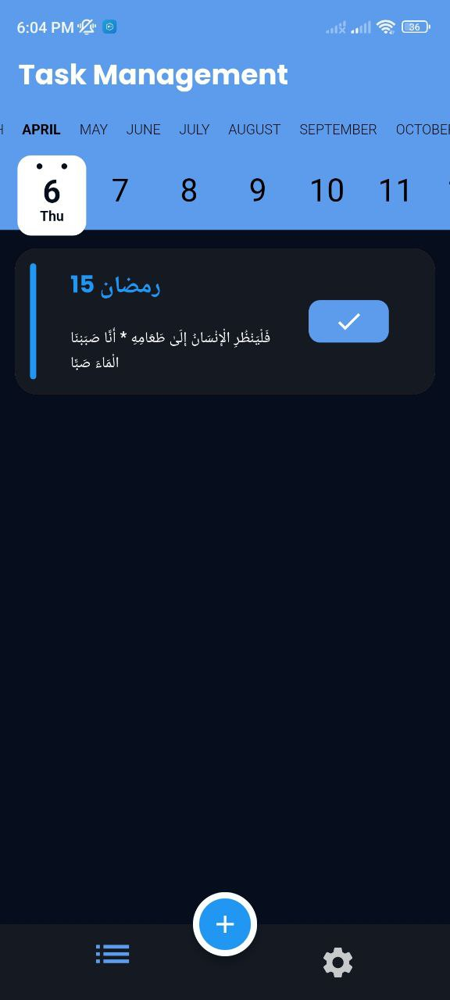 |
| Edit Screen Light | Edit Screen Dark                       |
| 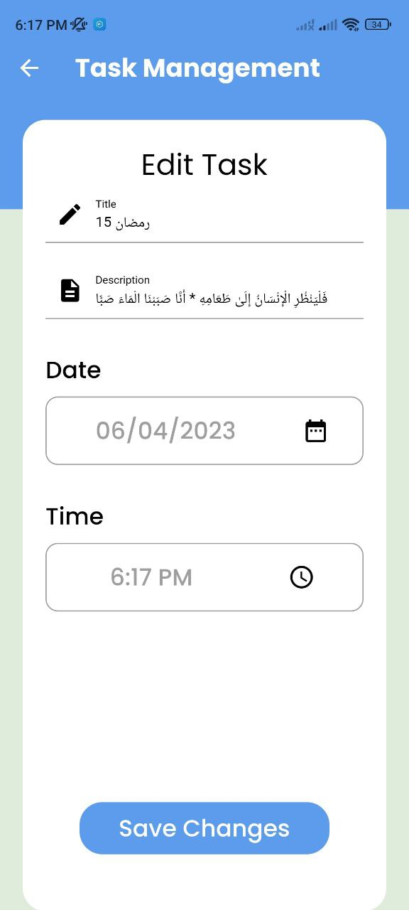 | 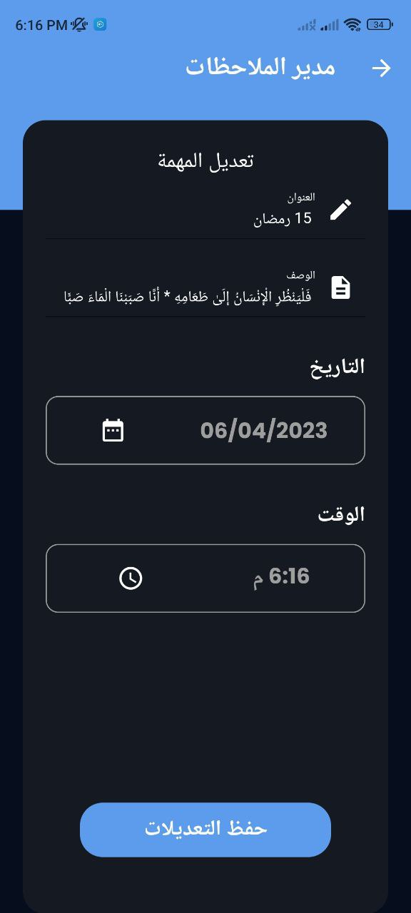 |
| Delete Task Light | Delete Task Dark                       |
|  | 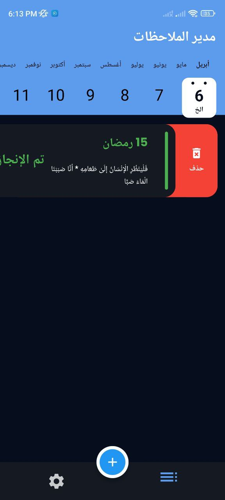 |
| Settings Screen Light | Settings Screen Dark                       |
| 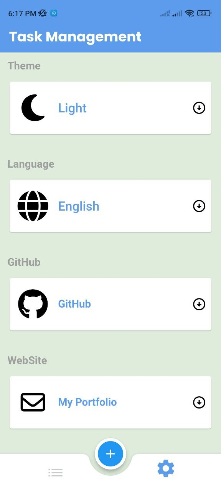 | 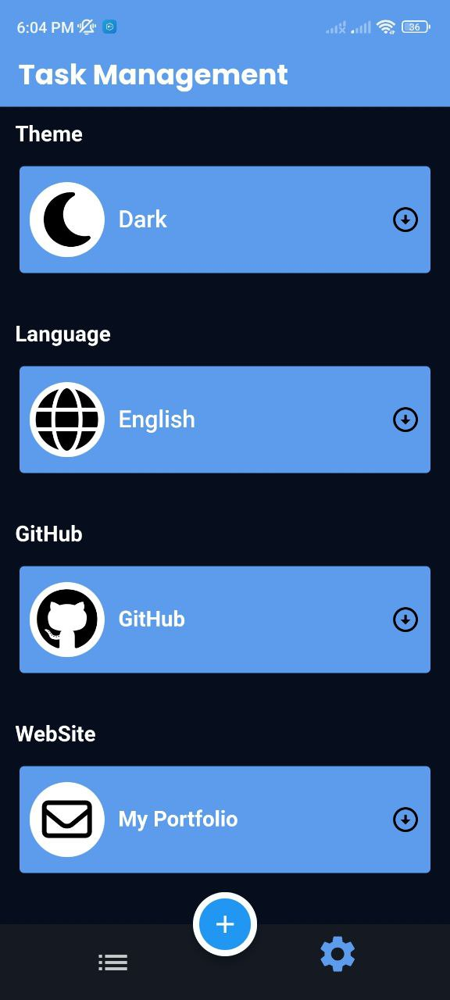 |
