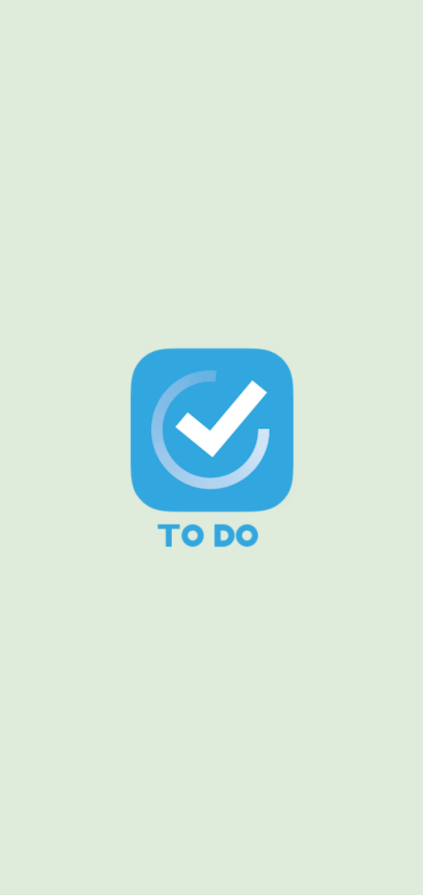
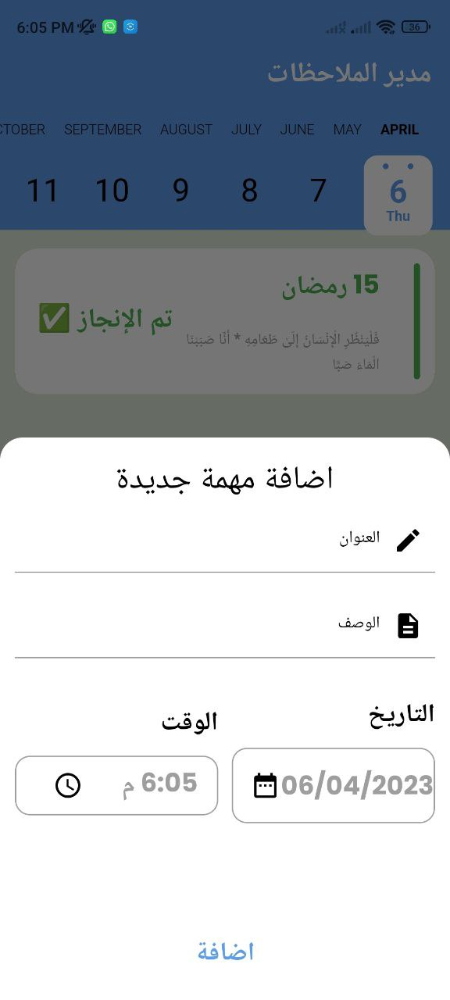
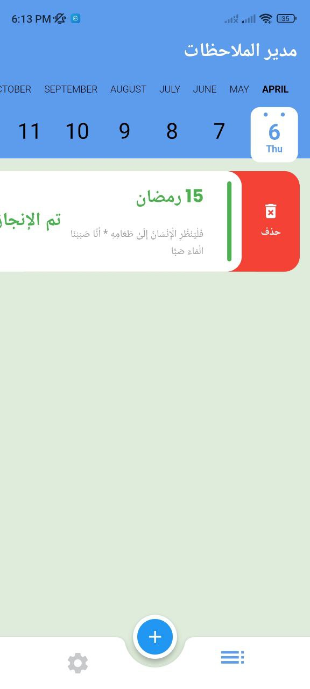

# task_management

Developed a notes application that allows users to store their notes as tasks, set deadlines, and track their progress
Used a task management system to help users organize their notes and stay on track
Implemented a reminder system to notify users of upcoming deadlines
Used a user-friendly interface to make the application easy to use

| Splash Screen | Splash Dark                       |
|------|-------------------------------------------|
||  |
| Tasks Screen Light | Tasks Screen Dark                       |
|  |  |
| Add Task Screen Light |  Add Task Screen Dark                       |
|  |  |
| Add Task Screen Light | Add Task Screen Dark                       |
|  |  |
| Tasks Screen Light | Tasks Screen Dark                       |
|  |  |
| Edit Screen Light | Edit Screen Dark                       |
|  |  |
| Delete Task Light | Delete Task Dark                       |
|  |  |
| Settings Screen Light | Settings Screen Dark                       |
|  |  |
