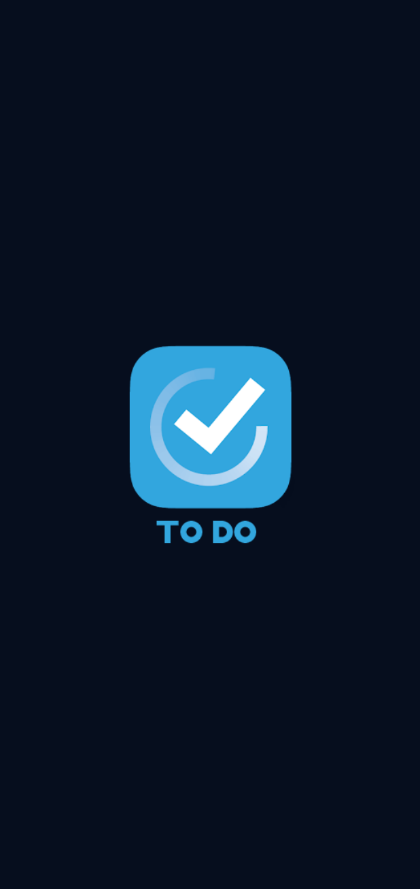

# task_management

| Splash Screen | Splash Dark                       |
|------|-------------------------------------------|
||  |
| Quran Screen Light | Quran Screen Dark                       |
|  |  |
| Ahadith Screen Light |  Ahadith Screen Dark                       |
|  |  |
| Sebha Screen Light | sebha Screen Dark                       |
|  |  |
| Settings Screen Light | Settings Screen Dark                       |
|  |  |
| Edit Screen Light | Edit Screen Dark                       |
|  |  |
| Delete Task Light | Delete Task Dark                       |
|  |  |
| Settings Screen Light | Settings Screen Dark                       |
|  |  |
